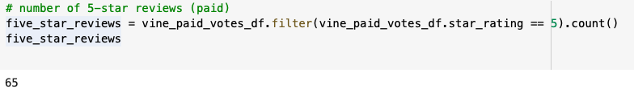
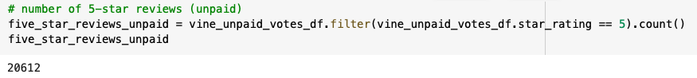
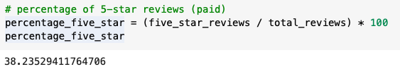
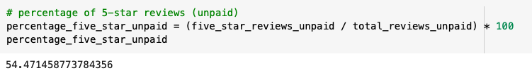
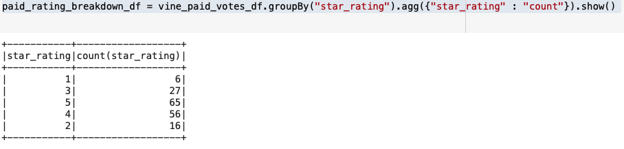
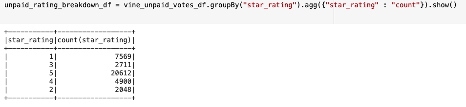

# Amazon_Vine_Analysis

## Overview
The purpose of this project is to analyze Amazon reviews on pet products to determine if there is any bias toward favorable reviews from Vine members.

## Results
   - When looking at the breakdown of pet product reviews, we can see that there were a total of 170 Vine reviews and 37,840 non-Vine reviews. 
     - 
     - 
   - There were 65 Vine reviews that were 5 stars and 20,612 non-Vine reviews that were 5 stars. 
     - 
     - 
   - 38.2% of total Vine reviews were 5 stars and 54.5% of non-Vine reviews were 5 stars. 
     - 
     -  

## Summary
From this analysis, there is no evidence of positivity bias for reviews in the Vine program since a significantly larger percentage of non-Vine reviews had 5 stars. Another analysis we could perform would be to show an overall breakdown of rating scores for Vine and non-Vine reviews to see if ratings are generally skewed more positively as shown below: 
   - 
   - 

