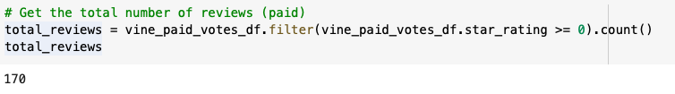

# Amazon_Vine_Analysis

## Overview
The purpose of this project is to analyze Amazon reviews on pet products to determine if there is any bias toward favorable reviews from Vine members.

## Results
 

 

   - When looking at the breakdown of pet product reviews, we can see that there were a total of 170 Vine reviews and 37,840 non-Vine reviews. 
   - 
   - 
   - 
